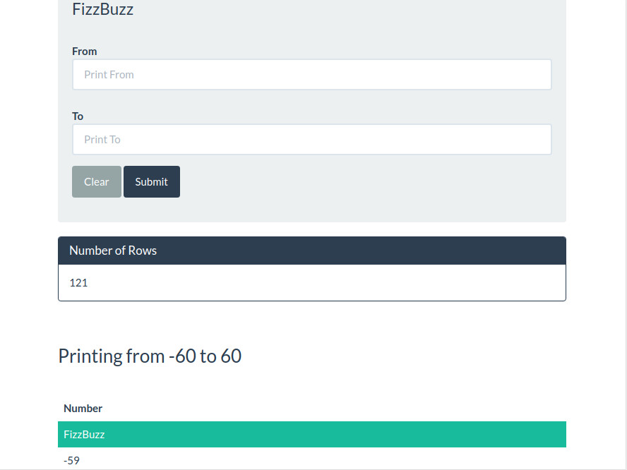

# FizzBuzz App

## Live Demo
[Click for a Live Demo](http://onegreatapp.com/fizzbuzz/)
## Description
The program generates a table of values from a specified range given by the user. It outputs specific text instead of the value if it is a multiple.

For example, multiples of three print "Fizz", multiples of five print "Buzz", multiples of three and five print "FizzBuzz". Lastly, for multiples of 10, the table row is highlighted green.

## Technologies
PHP, Bootstrap 4